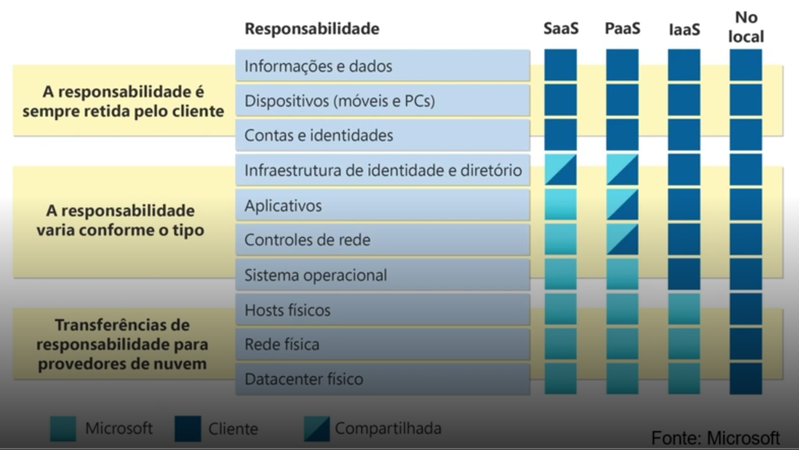

# Tipos de serviço na nuvem Azure

- **IaaS (Infrastructure as a Service):** Fornece infraestrutura de TI virtualizada, como servidores, armazenamento e redes, permitindo que as empresas criem e gerenciem seus próprios ambientes de TI sem precisar investir em hardware físico. As empresas são responsáveis por gerenciar o sistema operacional, aplicativos e dados, enquanto o provedor de nuvem é responsável pela infraestrutura subjacente. Modelo muito utilizado na migração lift and shift, onde as empresas migram suas aplicações para a nuvem sem fazer alterações significativas na arquitetura ou no código.

- **PaaS (Platform as a Service):** Fornece uma plataforma completa para desenvolvimento, teste e implantação de aplicativos, incluindo infraestrutura, middleware, ferramentas de desenvolvimento e serviços de banco de dados, permitindo que os desenvolvedores se concentrem na criação de aplicativos sem se preocupar com a gestão da infraestrutura subjacente. O provedor fica responsável por gerenciar a infraestrutura, o sistema operacional e o middleware, enquanto os desenvolvedores são responsáveis por gerenciar os aplicativos e os dados. Modelo muito utilizado para desenvolvimento de aplicações nativas da nuvem, onde as empresas criam aplicações que aproveitam os recursos e serviços oferecidos pela nuvem.

- **SaaS (Software as a Service):** Fornece aplicativos prontos para uso, acessíveis pela internet, eliminando a necessidade de instalação, manutenção e gerenciamento de software local. Exemplos incluem Microsoft 365, Salesforce e Google Workspace. Normalmente aqui já é uma visão mais voltada para o usuário final, onde as empresas utilizam aplicativos prontos para uso, sem a necessidade de se preocupar com a infraestrutura ou o desenvolvimento dos aplicativos.

## Modelo de responsabilidade compartilhada ##

